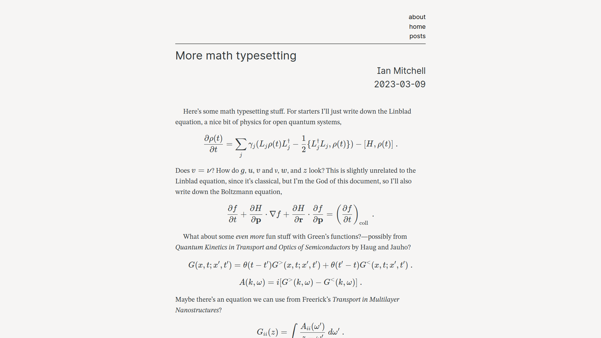

# Delay
> A hugo complement for my [pandoc theme][quetzal].

Hermes is based off of [XMin][xmin], an extremely simple Hugo theme. So far, 
Hermes has a *minimal* feature set, including math rendering, rough responsive
design, and more.

There's a lot of work that still needs to be done, so I wouldn't suggest using
this for your website quite yet.

[quetzal]: https://github.com/pretentiousUsername/quetzalcoatl
[xmin]: https://github.com/yihui/hugo-xmin
